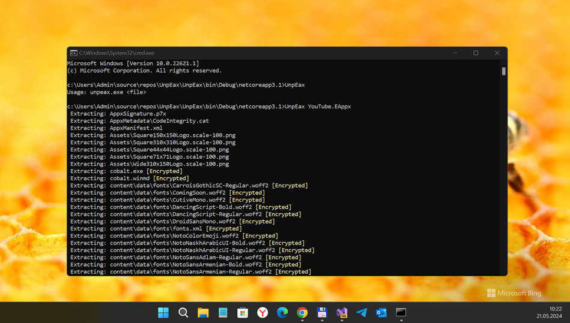

# UnpEax

## About 

Console app for extracting (but not decrypting) EAppX/EAppXBundle/EMsiX/EMsiXBundle files

## Screenshot

## My 2 cents
- Simplest cmd-line args parsing added :)

## Tech. details 
- Forked from https://github.com/dalion619/UnpEax
- Based of work done by [WalkingCat](https://twitter.com/_h0x0d_) with additional [info](EAPPX_Info.md) provided by [Sgt.Pepper](https://twitter.com/sgtpepp4r)

## References & Links
* https://github.com/dalion619/UnpEax 
* [UnpEax Gist](https://gist.github.com/WalkingCat/1c119933f7f6ce0e00c45a4fb80f2686)
* [EAPPX Pastebin](https://pastebin.com/zH5tet0b) [Source](https://twitter.com/sgtpepp4r/status/1268608220483874816)

## ..
As is. No support. RnD only. DIY :)

## .
[m]edia[e]xplorer 2024

